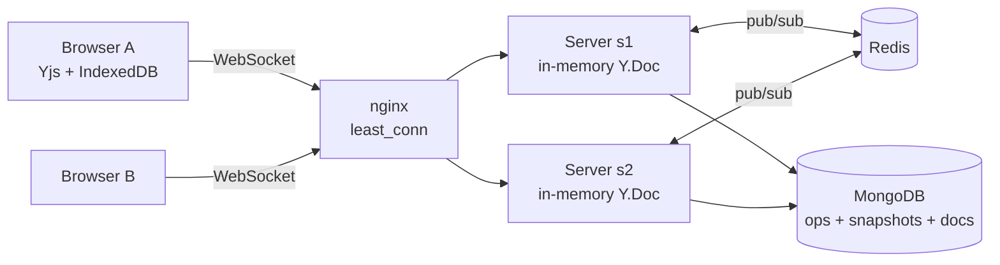

# SyncPad design notes

## Goals

1. Many people edit one document with sub-second propagation and **no lost edits**.
2. Survive server restarts, flaky networks, and offline periods.
3. Scale by adding server instances without sticky sessions.
4. Enforce permissions on the server.

## Architecture

- **Browser:** TipTap editor bound to a `Y.Doc`. Local edits apply instantly (no round trip), are sent as small binary updates, and are mirrored to IndexedDB for offline use.
- **Server instance:** holds a `Y.Doc` in memory for each document that has active clients *on that instance*. It relays updates between its sockets, appends them to storage, and publishes them to Redis.
- **Redis:** fan-out between instances only. It stores nothing durable.
- **MongoDB:** system of record.

## Why a CRDT (Yjs) and not OT

| | OT (Google Docs style) | CRDT (Yjs) |
|---|---|---|
| Central server required for correctness | Yes: must serialize/transform ops | No: updates commute, any order converges |
| Offline / long-lived divergence | Hard | Natural: merge on reconnect |
| Multi-instance scaling | Needs a per-doc sequencer (single owner) | Any instance can accept any update |
| Cost | Low metadata | Higher metadata (mitigated by Yjs's compact encoding and GC) |

Because Yjs updates are **commutative and idempotent**, the server needs no ordering guarantees. That is what makes the Redis layer simple: duplicates and reordering are harmless.

## Sync protocol

Stock y-websocket wire protocol: on connect both sides exchange **sync step 1** (state vector), reply with **sync step 2** (only the missing updates), then stream incremental **updates**. Awareness (cursors/presence) travels as a separate message type and is ephemeral: never stored.

Server-side additions:
- **Auth at upgrade:** JWT verified and the user's role on the doc checked before the socket is accepted.
- **Viewer enforcement:** for viewers only sync-step-1 (read) and awareness messages are processed; step-2/update messages are dropped.
- **Message ordering during load:** a client's first messages arrive before the doc has loaded from the DB. All handlers chain on one `docReady` promise, so they queue and run in order.
- **Rate limit + payload cap** per socket; violators are closed with code 4429 and the client reconnects and re-syncs.

## Multi-instance fan-out

Every locally-originated update and awareness change is published to `syncpad:doc:<id>`. Other instances that hold that doc apply it with origin `'redis'`, which (a) fans it out to their sockets and (b) is **not** re-published or re-persisted. That origin tag prevents echo loops and duplicate writes: **only the instance that received an update from a client persists it.**

### The race I had to close: late-loading instances

Persistence is batched (default 250 ms). Suppose instance 1 has an edit that is published but not yet written to MongoDB, and instance 2 then loads the doc from MongoDB. Instance 2 misses the edit: Redis already delivered it before instance 2 cared, and MongoDB doesn't have it yet. Its clients would diverge.

Fix: after loading a doc, an instance publishes `hello` with its state vector. Peers that hold the doc answer with `encodeStateAsUpdate(doc, theirStateVector)`: exactly the missing delta. The same `hello` is sent for all loaded docs after a Redis reconnect, covering messages lost during the outage. Covered by a test that sets `flushMs` to 60 s so nothing reaches the DB.

## Persistence model

- `ops`: append-only Yjs updates. Typing produces many tiny updates, so they are **batched** (`Y.mergeUpdates`) into one write per flush window.
- `snapshots`: one compacted state per doc with a `version` counter.
- **Load** = snapshot + all ops. **Compaction** (every N ops, and on idle unload) folds them into a new snapshot.

### Compaction correctness with multiple instances

Two hazards, both solved by working from the database rather than instance memory:

1. *Dropping another instance's op.* Compaction reads snapshot + ops **from MongoDB**, builds the merged state, and deletes **exactly the op ids it read**, not "everything older than X". An op inserted mid-compaction survives to the next round.
2. *Two compactions racing.* The snapshot write is a compare-and-set on `version` (`updateOne({_id, version: expected}, {$inc: {version: 1}})`, or insert-if-absent for the first snapshot). The loser gets `false`, deletes nothing, and retries later. Without this, a stale snapshot could overwrite a newer one whose ops were already deleted.

Because Yjs merges are idempotent, re-applying an op that is also inside a snapshot is harmless.

## Version history

A named version is a full `encodeStateAsUpdate` blob. **Restore** builds a temporary doc from the blob and, inside one transaction on the live doc, replaces the document fragment with clones of the saved content. Because it goes through the normal update path, it persists, publishes to other instances, and reaches every connected client with no special casing. Restore is itself a normal edit, so it is undoable.

## Security

| Concern | Handling |
|---|---|
| Authentication | bcrypt password hashes; 7-day JWT; verified at HTTP and WebSocket upgrade |
| Authorization | role checked per request and at upgrade; viewers cannot write via the socket |
| Existence leaks | non-members get 404, not 403 |
| Abuse | token bucket per socket, `maxPayload`, per-IP limits on auth routes, JSON body cap |
| Secrets | `JWT_SECRET` from env; the app warns if a placeholder is used |

Known gaps are listed in the README (revocation of live sockets, token in the WebSocket query string).

## Failure modes

| Failure | Behaviour |
|---|---|
| Server instance crashes | Clients reconnect (through nginx, possibly to another instance) and re-sync from state vectors. At most one batch window (≤250 ms) of edits *that never reached a client's IndexedDB/another instance* is at risk, and clients that saw them resend on reconnect anyway. |
| Redis down | Instances stop sharing live edits but each keeps serving its own clients and persisting. On reconnect, `hello` re-syncs. Docs that had clients on only one instance are unaffected. |
| MongoDB write fails | Batch is re-queued and retried every second; live sync continues from memory. |
| Client offline | Edits stay in IndexedDB and merge on reconnect. |
| Client floods messages | Socket closed with 4429; client reconnects and re-syncs. |
| Doc deleted | `evict` published; every instance closes its sockets with 4404. |

